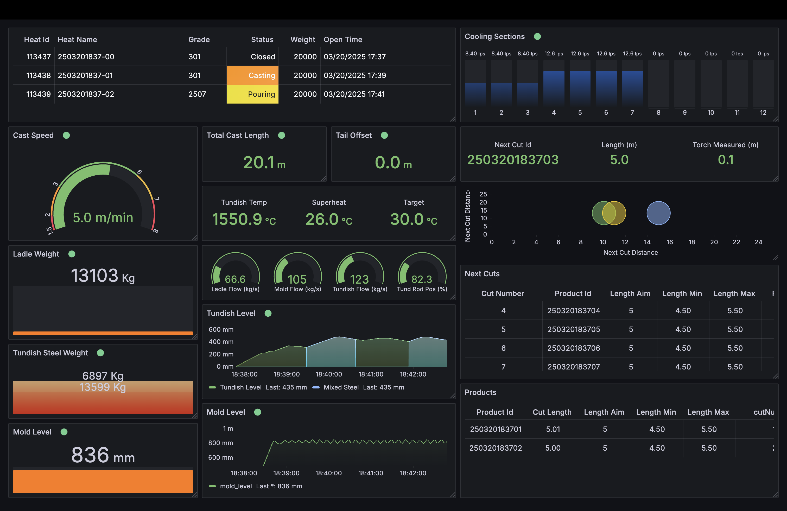
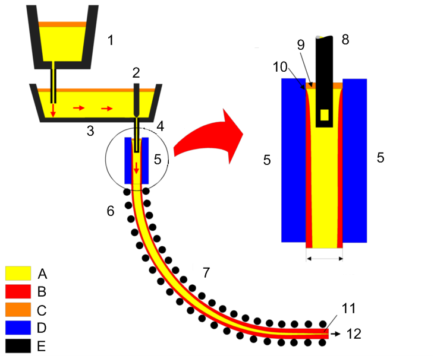

# Caster Simulator with Grafana Visualization and Splunk HEC Integration



## What is a Continuous Casting Machine?

A **Continuous Casting Machine (CCM)** is a key part of modern steel production. It transforms molten steel into solidified slabs, billets, or blooms by continuously pouring liquid steel into a mold while it is simultaneously withdrawn and cooled. The process eliminates the need for ingot casting (an older method where molten steel is poured into stationary molds called ingots, allowed to solidify completely, then reheated before further processing) and improves efficiency by reducing waste and improving product quality. Continuous casting creates a non-stop flow from liquid to solid state, whereas ingot casting requires multiple separate steps with cooling and reheating.



Continuous casting. 1: Ladle. 2: Stopper. 3: Tundish. 4: Submerged entry nozzle 5: Mold. 6: Roll support. 7: Turning zone. 8: Submerged entry nozzle 9: Bath level. 10: Meniscus. 11: Withdrawal unit. 12: Slab. A: Liquid metal. B: Solidified metal. C: Slag. D: Water-cooled copper plates. E: Refractory material. Source: Wikipedia https://en.wikipedia.org/wiki/Continuous_casting

### Steel Production Process

Before steel reaches the continuous casting stage, it undergoes several key steps:

1. **Ironmaking**: Iron ore is processed in a blast furnace to produce molten iron.
2. **Steelmaking**: Molten iron is refined in a basic oxygen furnace (BOF) or an electric arc furnace (EAF) to remove impurities and adjust composition.
3. **Secondary Metallurgy**: The steel is further treated to improve properties, such as adding alloying elements and controlling temperature.
4. **Continuous Casting**: The molten steel is cast into semi-finished shapes like slabs, billets, or blooms.

### Post-Casting Processes

After leaving the CCM, the solidified steel undergoes further processing depending on its intended application:

1. **Rolling Mills**: The slabs, billets, or blooms are reheated and rolled into final products such as sheets, bars, or beams.
2. **Heat Treatment**: Some steel products are heat-treated to improve mechanical properties.
3. **Finishing & Coating**: The steel is cut, shaped, coated, or treated for corrosion resistance before distribution.

### Industries and Applications

Steel is a fundamental material used across multiple industries:

- **Automotive**: High-strength steel sheets for car bodies.
- **Construction**: Beams and rebar for buildings and infrastructure.
- **Manufacturing**: Steel tubing, pipes, and machine components.
- **Energy**: Pipeline steel, turbine components, and offshore structures.
- **Shipbuilding**: Heavy-duty steel plates for hulls and decks.

## CasterSimulator

CasterSimulator is an educational and research-oriented tool developed in C# (.NET 8.0) designed to partially replicate the behavior of a **Continuous Casting Machine (CCM)**. It is not a Digital Twin but could be adapted into one. The simulator models key components of a CCM, tracking steel flow from the **ladle**, through the **tundish**, **mold**, and **strand**, until it is cut into finished products.

### Simulation Scope

A real CCM is highly complex from a control and automation perspective. This simulator does not attempt to fully replicate the complexity of an actual CCM. Instead, it uses **simplified algorithms** to generate **semi-realistic data** that can be used for educational purposes, UI testing, and research into casting behavior and data visualization.


## Features and Components

### Mixed Steel Tracking

Implements the "tundish 50% rule" where when a new heat enters a container with existing steel, 50% of the existing steel is considered mixed. This simplified model approximates the complex fluid dynamics of real casters.

#### Why Mixed Steel Tracking is Critical

- Different steel grades have different chemical compositions and properties
- The transition zone between heats may not meet specifications for either grade
- Producers need to identify which sections to downgrade or potentially scrap
- Customer quality certifications require precise composition knowledge
- Production planning benefits from understanding grade transition behavior

### Cut Scheduling Optimization

Implements rules to maximize material utilization when cutting products from the strand:

- Adjust product lengths within their min/max tolerances
- Add extra products when excess steel is available
- Handle remnants by creating special "tail" products
- Prevent cuts less than 4 meters to avoid issues with rolling table handling
- Dynamically optimize the remaining schedule when nearing the end of a sequence

## Components

### Turret
A rotating platform that holds multiple ladles and positions them for sequential casting.

### Ladle
A large refractory-lined container that holds molten steel and pours it into the tundish in a controlled manner. The simulator includes simplified models for:
- Steel turbulence
- Occasional clogging events

### Tundish
A reservoir that ensures a steady flow of molten steel into the mold and helps control temperature and cleanliness. Features include:
- Superheat (temperature above liquidus) modeling
- Stopper rod position calculation based on flow rate

### Mold
A water-cooled mold that shapes the steel while initial solidification occurs:
- Controlled through a simplified feedback loop
- Uses a fixed mold width
- Adjusts tundish flow rates based on mold level

### Strand
The continuous solidifying steel as it moves through the machine:
- Tracks strand position, speed, and length
- Simplified representation of physical phenomena

### Cooling Sections
Multiple cooling zones that regulate the steel's temperature:
- Activates cooling based on strand position
- Adjusts flow rates proportionally to casting speed

### Torch
A cutting device that divides the continuous strand into finished products:
- Resembles a pendulum shear (mechanical cutting)
- Determines product lengths

### Flow Control
Dynamically adjusts tundish and ladle flow rates:
- Uses a proportional control algorithm
- Implements error-based correction factors
- Includes rate-limiting to prevent excessive fluctuations

### Speed Control
Ensures smooth acceleration and steady-state speed:
- Implements a linear ramping function
- Gradually increases speed from start to target

## Project Configuration Files

### Steel Grades Configuration (`steel_grades.json`)

The `steel_grades.json` file is a foundational resource for future advanced simulation capabilities, designed to support:

- **Steel Mixing Rules**: Precise modeling of heat transitions and mixed steel behavior
- **Adaptive Cooling Practices**: Customized cooling strategies based on specific steel grade properties
- **Dynamic Cast Speed Ramping**: Optimizing casting speed according to steel grade characteristics
- **Metallurgical Modeling**: Enabling more sophisticated simulation of steel production processes

Currently, the file contains a comprehensive list of steel grades with detailed information:

- **SteelGradeId**: Unique identifier for the steel grade
- **SteelGradeGroup**: Classification group (e.g., HC: High Carbon, LC: Low Carbon, ULC: Ultra Low Carbon)
- **LiquidusTemperatureC**: Melting point temperature in Celsius
- **Description**: Detailed description of the steel grade
- **TargetSuperheatC**: Target temperature above the liquidus point
- **Chemistry**: Detailed chemical composition, including:
    - Element names (C, Mn, Si, P, S, Cr, Ni, etc.)
    - Percentage of each element

Supported steel grades include:
- Austenitic Stainless Steels (301, 304, 316, 321)
- Martensitic Stainless Steels (410, 420)
- Ferritic Stainless Steel (430)
- Duplex Stainless Steels (2205, 2507)

### Simulator Configuration (`configuration.json`)

The `configuration.json` file defines critical parameters for the continuous casting simulation:

#### Tundish and Pouring Parameters
- **TundishWeightFluctuationTolerance**: Maximum allowable weight variation
- **TundishWeightCorrectionFactor**: Factor for weight adjustments
- **MaxTundishWeight**: Maximum weight capacity
- **LowPouringRate** and **HighPouringRate**: Minimum and maximum pouring rates
- **SteadyStateRate**: Optimal pouring rate

#### Casting Speed Parameters
- **TargetCastSpeed**: Desired casting speed
- **SpeedRampDuration**: Time to reach target speed
- **RampUpThreshold**: Weight threshold for speed ramp-up

#### Physical Properties
- **SteelDensity**: Density of steel
- **TorchLocation**: Location of cutting torch

#### Cooling Section Configuration
Detailed configuration for 12 cooling sections, including:
- Start and end positions
- Nozzle types and positions
- Flow rate calculations based on casting speed

## Grafana Dashboard

A Grafana Live dashboard provides real-time visualization of the casting process, including:

### Heat Information
- Heat ID, Name, Grade, Status
- Weight and Close Time
- Visual status indicators

### Process Parameters
- Cast Speed
- Total Cast Length
- Tail Offset
- Tundish Temperature and Superheat
- Component Flow Rates
- Tundish Rod Position

### Cooling Sections
- Cooling water flow rates
- Numbered cooling zones
- Color-coded active sections

### Level Indicators
- Ladle Weight
- Tundish Steel Weight
- Mold Level
- Time-series graphs with mixed steel tracking

### Product Information
- Cut ID details
- Product specifications
- Length measurements

## REST API Endpoints

### Heat Schedule
- `GET /api/heatschedule`: Retrieve current heat schedule
- `POST /api/heatschedule`: Update heat schedule

### Cut Schedule
- `GET /api/cutschedule`: Retrieve scheduled cuts
- `POST /api/cutschedule`: Update cut schedule

### Products
- `GET /api/products`: Retrieve product data
- `POST /api/products`: Update product data

## Use Cases

- **Educational & Research**: Understanding continuous casting machine behavior
- **User Interface Testing**: Validating industrial dashboards in Grafana
- **Data Integration & Analysis**: Real-time and historical data visualization

## System Requirements

- Developed and tested under macOS Sonoma 14.1
- Should be compatible with Windows and other macOS versions that support .NET 8.0.
- Docker Desktop
- Visual Studio 2022, Visual Studio Code or JetBrains Rider.
- Git
  
## Installation Steps

### Clone this repository and change into the project directory:

```sh
cd CasterSimulator
```

### Install Dependencies

Restore the project dependencies using the .NET CLI:

```sh
dotnet restore
```

### Start Monitoring Services

The project includes a `docker-compose.yml` file to set up VictoriaMetrics and Grafana. Adjust port numbers and paths for persistent storage if necessary.

```sh
# Start the monitoring services
docker-compose up -d
```

## Running CasterSimulator

### Start the Web API

The Web API provides essential services for the Caster Simulator and should run first.

```sh
dotnet run --project CasterSimulator.WebAPI
```

Test access to the REST API with swagger:

http://localhost:5087/swagger

### Run the Simulator

To start the main simulator application:

```sh
dotnet run --project CasterSimulator.Engine
```
This should immediately start a new steel casting sequence, which is composed of a series of heats and products.

The logic to generate heats and products can be found in CasterSimulator.Components - Sequence.cs.

## Visualizing the casting process with Grafana.

To access Grafana UI go to http://localhost:3000

### Create an Access Token

In Grafana, navigate to Home - Administration - Users and access - Service Accounts.

Store your tokens securely

```sh
dotnet user-secrets set "Telemetry:GrafanaLiveToken" "your-grafana-token" --project CasterSimulator.Telemetry
```

These secrets are stored in a protected location on your machine and will be loaded at runtime.

Verify secrets

```sh
dotnet user-secrets list --project CasterSimulator.Telemetry
```

### Create an Inifinity data source.

Add a new Infinity data source and set the authentication to No Auth.

### Import Caster Overview Dashboard.

In Grafana, Home - Dashboards - New, load the grafana-dash-caster-overview.json file provided in this repository.

This dashboard was designed for a 3840x2160 display.

## In Progress
The following features are being developed to enhance CasterSimulator's capabilities:

- Splunk HEC Integration: An interface to send structured casting data to Splunk HEC (HTTP Event Collector) for in-depth analysis, log correlation, and real-time alerts.

- AI-Ready Data Transformer: A new module that converts time-series and process metrics into structured, content-rich text summaries suitable for use by Large Language Models (LLMs). This will support AI-assisted analysis, automated reporting, and contextual alert explanations.

## Future Development Plans

- Complete VictoriaMetrics integration
- Improve simulation accuracy
- Refine steel flow models
- Expand API capabilities
- Implement OPC UA interface
- Create additional Grafana dashboards for historical data analysis.
- Add support for OpenTelemetry to simplify integration with multiple interfaces.
- Add integration with Splunk HEC for analysis of casting events.
- Add functionality to push production schedules via API.
- Refactor and clean up.

